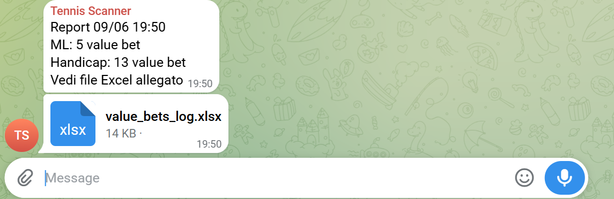
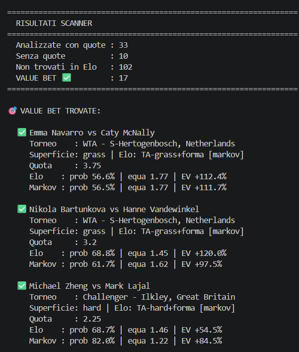
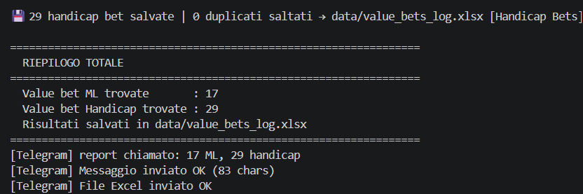
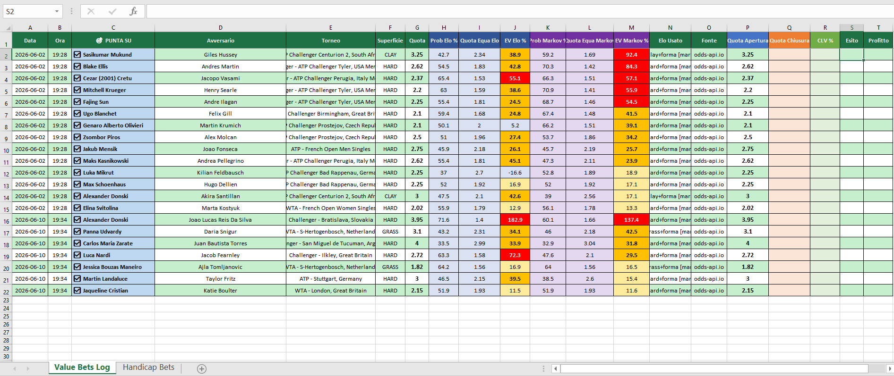
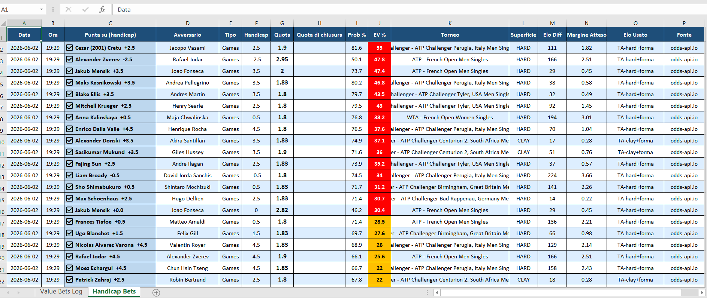

# 🎾 Tennis Value Betting Scanner

> Un sistema automatico che analizza le partite di tennis professionistico alla ricerca di valore nelle scommesse, confrontando le probabilità stimate dai modelli con le quote live dei bookmaker — e uno studio quantitativo onesto su se questo vantaggio esista davvero.

🇬🇧 *[English version →](README.md)*

---

## In breve

Questo progetto costruisce una pipeline end-to-end che:
1. **Estrae** i rating dei giocatori (Elo + statistiche servizio/risposta) da fonti pubbliche
2. **Stima** le probabilità di vittoria con due modelli indipendenti (Elo e un modello Markov punto-per-punto)
3. **Confronta** quelle probabilità con le quote live di The Odds API e Betfair per individuare i "value bet" (valore atteso positivo)
4. **Registra e valida** ogni giocata per misurare la reale capacità predittiva

**Il risultato più importante è negativo:** un'analisi rigorosa del Closing Line Value (CLV) ha dimostrato che il modello *non* batte il mercato. Questo README documenta sia l'ingegneria sia quella conclusione, perché saper riconoscere *quando una strategia non funziona* — ed essere in grado di dimostrarlo — vale più di un backtest che sembra buono.



---

## Perché questo progetto

Volevo rispondere a una domanda concreta: **un modello costruito su dati pubblici può trovare valore sistematico nei mercati delle scommesse sul tennis?**

È una buona domanda per un portfolio perché tocca molte competenze reali — web scraping, modellazione probabilistica, integrazione di API, validazione statistica e automazione — e perché la risposta *onesta* richiede di resistere alla tentazione di fare overfitting finché i numeri non diventano belli.

---

## Architettura

```
tennis-scanner/
├── main.py                      # Entry point: lancia gli scanner ML + Handicap
├── config.py                    # Configurazione (soglie, scelta modello, segreti via .env)
├── modules/
│   ├── scanner.py               # Scanner Money Line
│   ├── scanner_handicap.py      # Scanner Handicap
│   ├── markov.py                # Modello punto-per-punto (Barnett-Clarke)
│   ├── signals.py               # Probabilità da Elo (prob_da_elo)
│   ├── elo_tennisabstract.py    # Scraping Elo + età da Tennis Abstract
│   ├── forma_recente.py         # Aggiustamento forma recente
│   └── notifiche_telegram.py    # Invio report Telegram
├── valida_modelli.py            # Validazione: Elo vs Markov vs closing line
├── test_markov.py               # Test unitari del modello Markov
└── data/                        # Cache Elo, storico, log Excel (gitignored)
```

### Flusso dei dati

```
Tennis Abstract (Elo, servizio/risposta, età)
            │
            ▼
   ┌─────────────────┐      ┌──────────────────────┐
   │  Modello Elo    │      │  Modello Markov      │
   │  (signals.py)   │      │  (markov.py)         │
   └────────┬────────┘      └──────────┬───────────┘
            │                          │
            └────────────┬─────────────┘
                         ▼
              Stima probabilità di vittoria
                         │
                         ▼
   ┌──────────────────────────────────────────┐
   │  Quote live (The Odds API + Betfair)      │
   └────────────────────┬─────────────────────┘
                         ▼
              Calcolo del Valore Atteso (EV)
                         │
                         ▼
        Value bet → log Excel + alert Telegram
                         │
                         ▼
              valida_modelli.py (analisi CLV)
```

---

## I due modelli

### 1. Modello Elo

Usa rating Elo specifici per superficie (cemento / terra / erba) estratti da Tennis Abstract, con aggiustamenti per forma recente, scontri diretti e fatica. La probabilità di vittoria deriva dalla formula Elo standard applicata alla differenza di rating.

### 2. Modello Markov punto-per-punto

Un approccio più granulare basato sul framework **Barnett-Clarke**. Invece di ridurre una partita a una singola differenza di rating:

- Stima la probabilità di ciascun giocatore di vincere un punto al servizio dalle statistiche servizio/risposta
- La propaga alla probabilità di **game** (forma chiusa),
- poi alla probabilità di **set** (catena di Markov sugli stati di game, incluso il tiebreak),
- poi alla probabilità di **match** (al meglio dei 3 o dei 5 set).

Supporta anche **aggiustamenti contestuali** — fatica estesa (set giocati negli ultimi 14 giorni), interazione età × superficie (gli over ~33 calano più rapidamente sull'erba), e un indice di velocità del campo parametrizzato.

Entrambi i modelli condividono la stessa interfaccia, così lo scanner può alternarli tramite `config.py` per un confronto A/B.

---

## Esempio di output

Lanciare `python main.py` avvia entrambi gli scanner in sequenza, recupera le quote
live e invia un report Telegram con il log Excel allegato. Di seguito un'esecuzione
reale accorciata (10 giugno 2026, stagione sull'erba in pieno svolgimento):

```
$ python main.py
=================================================================
  TENNIS SCANNER SUITE - 10/06/2026 09:48
=================================================================

=================================================================
  SCANNER A — MONEY LINE
=================================================================

🔒 Safety check fonti dati...
  Tennis Abstract : ✅ Tennis Abstract raggiungibile
  Odds-API.io     : ✅ Status 200

✅ Tutte le fonti disponibili — procedo

⚙️  Caricamento Elo Tennis Abstract...
  📦 Cache Elo valida (0.4h fa) — uso quella
✅ 1055 giocatori caricati

📅 Recupero partite da Odds-API.io...
  [+] 2026-06-10: 357 partite trovate
✅ 146 partite ATP/WTA trovate

=================================================================
  RISULTATI SCANNER
=================================================================
  Analizzate con quote : 20
  Senza quote          : 14
  Non trovati in Elo   : 99
  VALUE BET ✅         : 5
=================================================================

🎯 VALUE BET TROVATE:

  ✅ Panna Udvardy vs Daria Snigur
     Torneo    : WTA - S-Hertogenbosch, Netherlands
     Superficie: grass | Elo: TA-grass+forma [markov]
     Quota     : 3.1
     Elo    : prob 43.2% | equa 2.31 | EV +34.1%
     Markov : prob 46.0% | equa 2.18 | EV +42.5%

  ✅ Martin Landaluce vs Taylor Fritz
     Torneo    : ATP - Stuttgart, Germany
     Superficie: hard | Elo: TA-hard+forma [markov]
     Quota     : 3.0
     Elo    : prob 46.5% | equa 2.15 | EV +39.5%
     Markov : prob 38.5% | equa 2.60 | EV +15.4%

  ✅ Jaqueline Cristian vs Katie Boulter
     Torneo    : WTA - London, Great Britain
     Superficie: hard | Elo: TA-hard+forma [markov]
     Quota     : 2.15
     Elo    : prob 51.9% | equa 1.93 | EV +11.5%
     Markov : prob 51.9% | equa 1.93 | EV +11.6%

=================================================================
  SCANNER B — HANDICAP GAMES
=================================================================

  Partite analizzate   : 148
  VALUE BET ✅         : 13

  ✅ Marin Cilic (-1.5 games)  vs  Nuno Borges
     Torneo : ATP - S-Hertogenbosch, Netherlands  |  GRASS  |  Elo diff: 160
     Quota  : 3.1  |  Prob: 57.8%  |  EV: +79.3%

  ✅ Panna Udvardy (+3.5 games)  vs  Daria Snigur
     Torneo : WTA - S-Hertogenbosch, Netherlands  |  GRASS  |  Elo diff: 47
     Quota  : 2.1  |  Prob: 71.9%  |  EV: +51.1%

=================================================================
  RIEPILOGO TOTALE
=================================================================
  Value bet ML trovate       : 5
  Value bet Handicap trovate : 13
  Risultati salvati in data/value_bets_log.xlsx
=================================================================
[Telegram] Messaggio inviato OK
[Telegram] File Excel inviato OK
```

> *Nota: gli EV elevati mostrati sono stime del modello stesso. Come spiegato nella
> sezione Risultati principali qui sotto, sono sistematicamente gonfiati — l'analisi CLV
> dimostra che il vantaggio reale è molto inferiore. Questo output illustra cosa produce
> lo scanner, non una strategia profittevole.*





---

## Risultati principali

Il sistema è stato eseguito su partite reali (ATP/WTA Roma, Challenger di Wuxi e altri), e ogni giocata è stata registrata con la quota presa e la quota di chiusura.

### Accuratezza dei modelli (57 match con quota di chiusura registrata)

| Metrica | Elo | Markov | Migliore |
|---|---|---|---|
| Brier Score | 0.18503 | 0.18329 | Markov (più basso = meglio) |
| Log-Loss | 0.54916 | 0.54360 | Markov (più basso = meglio) |
| MAE vs Closing Line | 0.0704 | 0.0724 | Elo (marginalmente più vicino al mercato) |

Il modello Markov predice gli esiti in modo leggermente più accurato dell'Elo — un miglioramento piccolo ma costante.





### La conclusione onesta: il Closing Line Value

Il CLV — quanto le tue quote si confrontano con le quote di chiusura del mercato — è la misura di riferimento del vantaggio reale, perché la quota di chiusura è il prezzo più informato disponibile. Il ROI di breve termine è dominato dalla varianza; il CLV no.

L'analisi di calibrazione è stata inequivocabile:

| Grandezza | Valore |
|---|---|
| Probabilità media assegnata dal **modello** | 57% |
| Probabilità media implicita dal **mercato** (chiusura) | 46% |
| Win rate **reale** | 30% |
| EV *calcolato* dal modello | **+28,2%** |
| EV *reale* (basato sulle quote di chiusura) | **+1,4%** |

**Il modello sovrastima sistematicamente le probabilità degli sfavoriti.** Il "valore atteso" che riporta è in gran parte il divario tra un modello scalibrato e un mercato efficiente — non un vantaggio reale. Il filtro `EV ≥ 9%`, lungi dal trovare valore, in pratica selezionava gli *errori più grandi* del modello.

Questa è la lezione centrale del progetto: **su un mercato liquido, un modello costruito su dati pubblici compete contro prezzi che hanno già assorbito quelle stesse informazioni.** Il mercato vince.

### Perché è un pregio, non un fallimento

La tentazione in questa situazione è continuare ad aggiungere filtri ("solo terra, solo sfavoriti tra 2,1 e 2,4, solo di mercoledì") finché un sottoinsieme non mostra rendimenti positivi. Questo è **overfitting** da manuale — misurare il rumore in un campione minuscolo. Questo progetto si *rifiuta* esplicitamente di farlo, e riporta invece il risultato negativo in modo onesto. Saper progettare un esperimento, eseguirlo e accettare la risposta che fornisce è la vera competenza in mostra qui.

---

## Stack tecnologico

- **Python 3.10+**
- **pandas / numpy** — gestione dati e calcolo numerico
- **requests / BeautifulSoup** — scraping e chiamate API
- **openpyxl** — logging strutturato su Excel
- **python-dotenv** — gestione dei segreti
- Fetch concorrente delle quote con un thread pool
- Test unitari per la matematica del Markov (`test_markov.py`)

---

## Come eseguirlo

```bash
# 1. Clona ed entra nel progetto
git clone https://github.com/saviodambrosio/tennis-scanner.git
cd tennis-scanner

# 2. Crea il virtual environment
python -m venv venv
source venv/bin/activate        # su Windows: venv\Scripts\activate

# 3. Installa le dipendenze
pip install -r requirements.txt

# 4. Configura i segreti
cp .env.example .env
# poi modifica .env con le tue API key

# 5. Lancia lo scanner
python main.py

# Esegui la validazione dei modelli
python valida_modelli.py

# Esegui i test unitari del Markov
python test_markov.py
```

### Configurazione

Impostazioni principali in `config.py`:

| Impostazione | Descrizione |
|---|---|
| `MODELLO` | `"elo"` o `"markov"` — quale modello usare |
| `EV_MINIMO` | Valore atteso minimo per segnalare una giocata (es. `0.09`) |
| `MARKOV_ETA_SUPERFICIE` | Attiva/disattiva l'aggiustamento età × superficie |
| `TELEGRAM_ABILITATO` | Interruttore master per le notifiche Telegram |

Le API key e i token vengono letti da un file `.env` (mai committato).

---

## Cosa farei diversamente / direzioni future

Il risultato onesto sul CLV indica dove potrebbe trovarsi un vantaggio *reale* — nessuno dei quali accessibile tramite dati pre-match pubblici:

- **Mercati illiquidi** (ITF / Challenger minori) dove i bookmaker usano modelli più grezzi e commettono errori di prezzo reali
- **Segnali di movimento delle quote** — seguire lo sharp money nei minuti dopo l'apertura di un mercato, invece di competere col prezzo di chiusura
- **Dati proprietari** — segnali di infortunio, effetti di viaggio/calendario prezzati prima che il mercato reagisca

Il modello punto-per-punto sarebbe molto più interessante usato contro un bookmaker pigro su un torneo ITF da 15k che contro Pinnacle su un match ATP.

---

## Disclaimer

Questo è un progetto di ricerca e di portfolio. **Non** è un consiglio per le scommesse, e la sua stessa conclusione centrale è che la strategia non produce un vantaggio profittevole contro mercati efficienti. Gioca responsabilmente, se proprio devi.

---

**Autore:** [saviodambrosio](https://github.com/saviodambrosio)
**Licenza:** MIT
